# A complete DNA-SIP example

`src/data/valid/Database-sip-lifecycle.yaml`
illustrates sample processing through raw sequence files. All identifiers,
measurements and sequence-file URLs are synthetic. Three fractions per gradient
keep the example readable; this is a metadata example, not an experimental design
or a laboratory protocol. The original `Database-sip_example.yaml` remains a
smaller labeling–extraction–fractionation example.

## Follow the material

The sequence follows the DNA-SIP overview in [Simpson et al. (2024), Figure 1](https://pmc.ncbi.nlm.nih.gov/articles/PMC11471955/)
and the [DNA-SIP protocol of Dunford and Neufeld (2010)](https://doi.org/10.3791/2027).

1. A `Biosample` supplies separate aliquots for two `IsotopeLabelingProcess`
   records. Aliquoting is implicit here. One receives 13C-enriched toluene, the
   other toluene at natural abundance. Each process produces incubated material
   as a `ProcessedSample`. Incubation duration belongs on the process; substance,
   label status, isotope, dose and atom fraction belong in its
   `isotopolog_additions` entries.
2. `Extraction` recovers DNA from each incubated sample. Each unfractionated DNA
   extract records `gradient_position: -1`.
3. `DensityGradientFractionationProcess` separates each extract into three
   `ProcessedSample` fractions. Positions run from heaviest (`1`) toward lightest.
   Density uses `g/mL`; relative nucleic acid amount is a decimal number. These
   are measured properties of the fractions. A dense fraction is not, by itself,
   proof of isotope incorporation: sequence composition also affects density.
4. A second `Extraction` for each fraction represents DNA recovery/purification.
   `LibraryPreparation` turns each purified DNA sample into a sequencing library.
   These outputs are also `ProcessedSample` records. Their process links lead
   back to the original fraction; the fraction metadata is not copied onto every
   downstream sample.
5. Each `NucleotideSequencing` consumes one library and produces one `DataObject`
   representing paired interleaved raw reads. Separate read-1/read-2 files would
   instead require two output DataObjects. Computational QC, assembly and SIP
   inference are beyond this example's raw-read endpoint.

Both experimental arms use `isotope: 13C`. The natural-abundance arm is identified
by `isotopolog_label: natural abundance`, not by an invented `12C` enum value.
The example's paired arms share a source Biosample and Study. Their names explain
the pairing for a reader; this does not introduce a machine-readable
treatment/control pairing relation.

Optional internal-standard methods and nucleobase excess atom fraction appear in
`DensityGradientFractionationProcess-internal-standard.yaml` and
`ProcessedSample-sip-fraction-measurements.yaml`. The lifecycle does not claim
those measurements or standards were used. The latter example also demonstrates
a density interval. Nucleobase excess atom fraction is not interchangeable with
the atom fraction of the added substrate and is not inferred from density alone.

## What the Manifest contributes

Each gradient has a `Manifest` with `manifest_category: fractions`. The sequence
DataObjects point to it through `in_manifest`. It groups files representing
fractions of that one sample for analysis; it does not group material samples or
replace the `has_input`/`has_output` provenance chain. The labeled and control
gradients therefore have separate manifests.

The schema does not enforce that all members of a fractions Manifest came from
the same gradient. The focused lifecycle test checks that property for this
example. Membership alone does not assert that fractions should be physically
pooled or reads concatenated. To illustrate physical pooling, add a `Pooling`
process consuming the selected fractions and producing a new `ProcessedSample`
before library preparation. No pooling occurs in this example.

## Generate the diagram from the Database

From the repository root, with its Poetry dependencies and Graphviz installed:

```sh
make sip-diagram
```

This updates `src/docs/images/sip-lifecycle.svg` and
`src/docs/images/sip-lifecycle.mmd`, with intermediate DOT in `local/`.
Changes to the YAML or generator cause regeneration. No hand-maintained node or
edge list is needed.



[Open the full-size SVG](images/sip-lifecycle.svg).
Green boxes are material samples, blue ellipses are processes, orange boxes are
data files, and purple boxes are manifests. Solid arrows show inputs/outputs;
dashed arrows show manifest membership. The Study is checked but not drawn.

For another Database instance, generate portable Mermaid source directly:

```sh
poetry run python src/scripts/database_to_diagram.py \
  src/data/valid/Database-sip-lifecycle.yaml local/example.mmd
```

Use `--format dot` for Graphviz source and `--direction LR` for a horizontal
layout. The script reads list-valued Database collections from YAML or JSON. It
draws records participating in `has_input`, `has_output`, or `in_manifest`, checks
those references plus `associated_studies` and `was_generated_by`, and rejects
duplicate IDs. It does not infer missing steps. By default, unresolved references
are errors. For deliberately partial examples, `--allow-external` draws undefined
flow endpoints explicitly; it does not make the example self-contained. This
closure check covers the listed slots, not every possible reference in the schema,
and is separate from schema validation.

## Example coverage and limits

At PR #3396 head `da406db84`, the SIP addition contained seven valid and six invalid
fixtures. The valid fixtures covered defined compounds, heterogeneous inputs,
multiple additions/isotopes, and a partial Database. All six counterexamples
targeted compound identification or the exactly-one-input rule. There was no
self-contained example reaching sequencing, no control arm, and no fractions
Manifest example.

This addition supplies three valid fixtures and fourteen single-defect
counterexamples, covering process inputs/outputs, isotope and label enums,
labeling approach, structured dose/atom-position/internal-standard values,
gradient position, density, relative amount and the upper bound on nucleobase
excess atom fraction. The lifecycle exercises required units: `h`, `[ppm]`, `1`
and `g/mL`. Structural validation and the NMDC unit-alignment plugin must both run.

Schema conformance does not establish experimental correctness. The schema does
not require a control, reference closure, a preparation order, a consistent
`single`/`multiple` count, or shared fraction provenance within a Manifest.
The labeling process's additions are recommended rather than required.
At the audited head, an isotopolog atom fraction of `1.2`, a relative nucleic acid
amount of `1.2`, and a gradient position of `0` also pass validation. They are
coverage gaps for scientific constraints, not usable schema counterexamples.
The unit plugin requires the exact annotated storage unit: even `g/cm3`, which
is physically equivalent to `g/mL`, is rejected for `gradient_pos_density` on
this branch. These findings do not change the schema in this example addition.
See the source schema when choosing further scientific constraints; do not label
a scientifically questionable value a schema-invalid example unless validation
actually rejects it.
